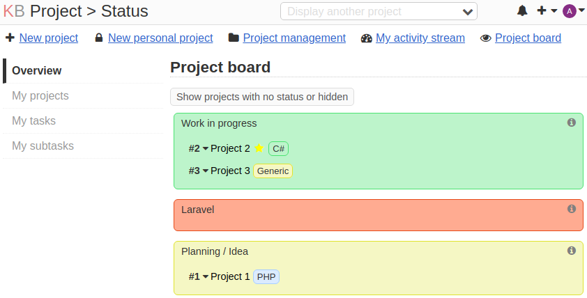

# Project status and visibility

**_Versioning for this package follows http://semver.org/. Backwards compatibility might break on upgrade to major versions._**

Requires Kanboard ^1.2.6

## Features

- [Show all projects on project board](#show-all-projects-on-project-board).
- [Add status to your project](#add-status-to-your-project).
- [Add color to status](#add-color-to-status).
- [Add visibility to status](#add-visibility-to-status).
- [View projects by status](#view-projects-by-status).
- [Hide projects by status](#hide-projects-by-status).
- [Hide individual projects](#hide-individual-projects).
- [Set default frontpage to project board](#set-default-frontpage-to-project-board).
- [Mark/Unmark project as focused](#markunmark-project-as-focused).

## Settings
Settings can be found under application settings.

## Installation
You have the choice of following methods:

### Download
Download the zip file and decompress everything under the directory `plugins/CRProject`.

### Clone
Clone this repository into the folder `plugins/CRProject`

### Show all projects on project board
Columns kan be specified under "Application settings".

Example of project board with 1 column.

Example of project board with 1 column.

### Add status to your project

### Add color to status

### Add visibility to status

### View projects by status

### Hide projects by status

### Hide individual projects

### Set default frontpage to project board

### Mark/Unmark project as focused
