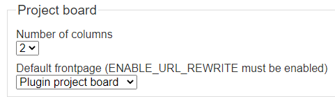
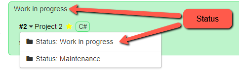
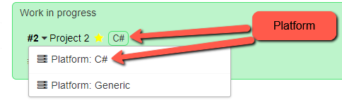
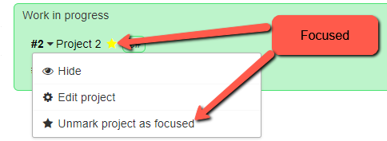
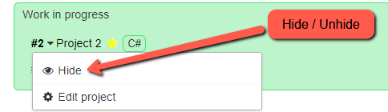
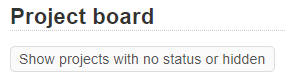
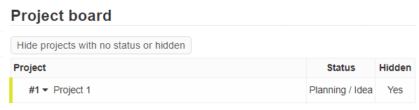
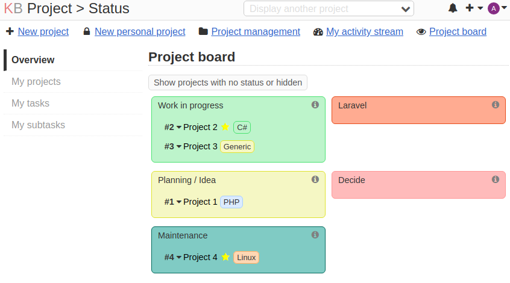

# Project status and visibility

**_Versioning for this package follows http://semver.org/. Backwards compatibility might break on upgrade to major versions._**

Requires Kanboard ^1.2.6

## Features

- Show all projects on project board.
- Add status to your project.
- Add color to status.
- Add visibility to status.
- View projects by status.
- Hide projects by status.
- Hide individual projects.
- Set default frontpage to project board.
- Mark/Unmark project as focused.

## Installation

You have the choice of following methods:

- Download the zip file and decompress everything under the directory `plugins/CRProject`.
- Clone this repository into the folder `plugins/CRProject`

## Settings

Settings can be changed under "Application settings" -> "Project board".

- "Number of columns" indicates how many columns shown side by side on project board.
- When clicking on "KB" up in left corner, the standard behaviour is to go to "Dashboard". This behaviour can be changed to "Plugin project board".

## Project status, platform, focus and visibility

Status can be maintained in settings under ""Project status". Properties are "Title", "Description", "Color" and "Visible".

Platform can be maintained in settings under "Project platform". Properties are "Title" and "Color".

Focus (starred) can be marked through menu.

Project visibility can be set through menu.

Hidden projects can be found under "Show projects....".

Example of project board with 2 columns.

